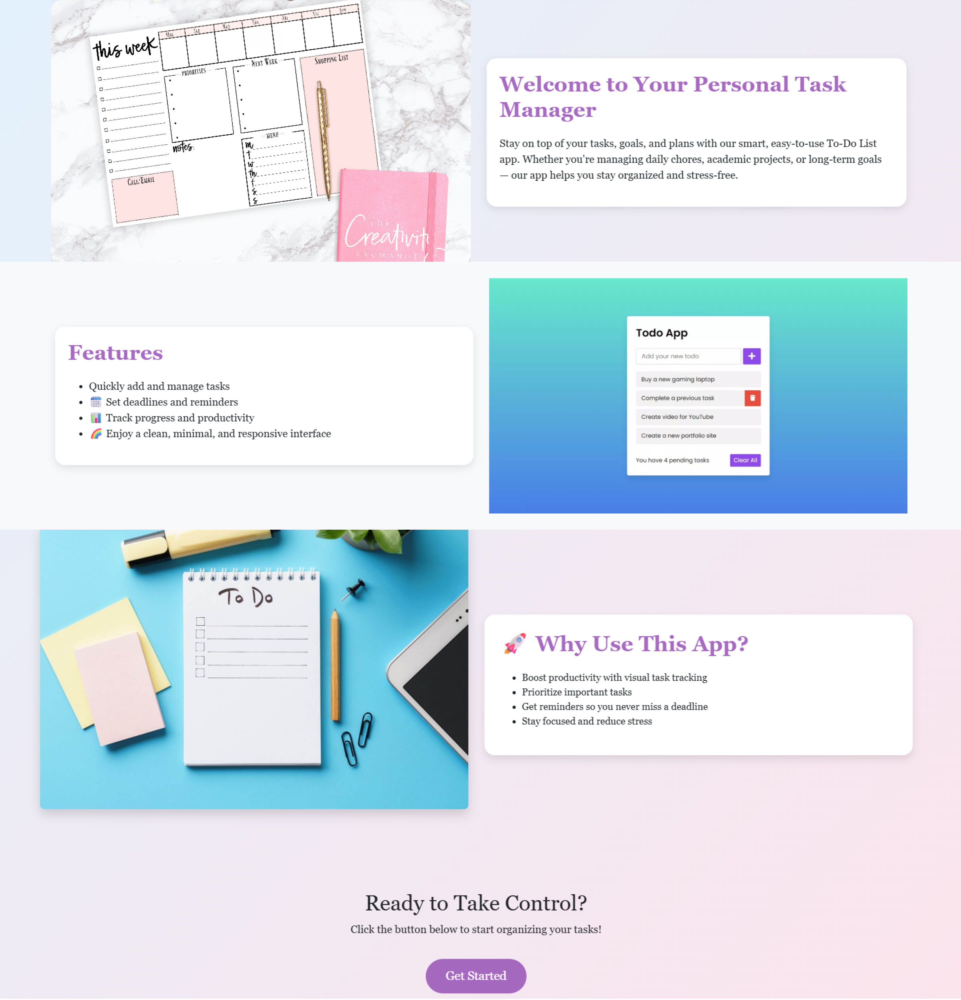
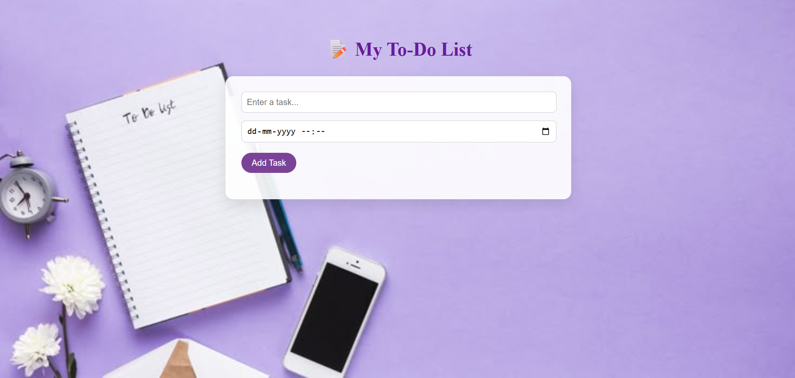
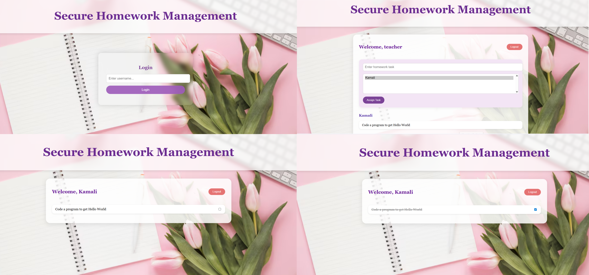

# To-Do List Web Application 📝

## 📌 Project Overview

The To-Do List Web Application is a simple and organized web-based task management system developed to help users manage their activities efficiently. The application allows users to handle personal tasks, set reminders for important activities, and manage academic homework through a secure and structured approach.

The project follows a clear workflow starting with an introduction page, followed by task selection and dedicated task management modules. It focuses on usability, clarity, and real-world application, making it suitable for both daily use and academic purposes.

---

## 🧭 Overall Application Flow

The application follows a clear and logical workflow to ensure ease of use.

### 1. Introduction & Awareness

The landing page introduces users to the importance of task organization and productivity. It visually explains how managing tasks can reduce stress and improve focus.

---

### 2. Task Mode Selection

After understanding the purpose of the application, users are presented with a card-based selection page. This allows them to choose the type of task management they want to use, ensuring flexibility for different needs.

---

### 3. Task Execution & Management

Based on the selected option, users are taken to dedicated task management pages where they can actively create, monitor, and complete tasks.

#### Reminder-Based To-Do Module

This module allows users to add tasks with reminders and track their completion status.

---

#### Secure Homework Management Module

This module supports role-based homework assignment and task tracking for students.

---

## 👤 Author

**Kamali J**  
🎓 Computer Science & Engineering (AI & ML)  
💻 Full-Stack & AI Enthusiast  
🔗 GitHub: [05Kamali](https://github.com/05Kamali)
